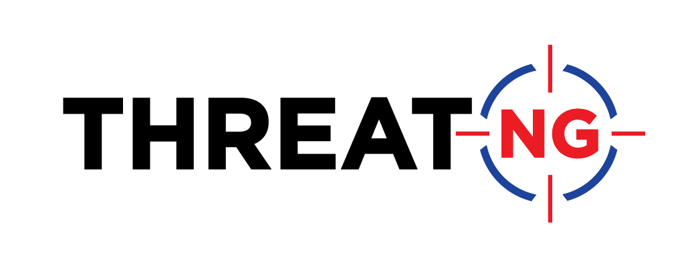

<h1 style="text-align: center;">Security Advisories</h1>

# Description
Organizations release Security Advisories about the products they build to inform their users of potential security risks and vulnerabilities.
<br> 
This repository contains the links to each listed organization's Security Advisories and their RSS Feed Link if one is present. 
<br>

<br>
<br>

# About ThreatNG


<div align="center">  

<p align="center">
ThreatNG is redefining external attack surface management (EASM), digital risk protection, and security ratings with a platform of unmatched breadth, depth, and capabilities in managing technical and business threats across the dark, deep, and open web. Living up to the company mantra (“Security Centric; Not Exclusive”), ThreatNG provides a configurable solution to target, discover, and assess digital assets across a definable ecosystem of organizations, subsidiaries, partners, third parties, supply chain, and customers. Bolstered and maintained by the open source intelligence (OSINT) experts at DarcSight Labs, ThreatNG empowers organizations of all types and sizes to uncover, understand, and manage their external digital threats. 

</p>

--- 


<p align='center'>

Connect with us on Social Media! 

 <a href="https://www.threatngsecurity.com/">
   
  </a>&nbsp;&nbsp;
  <a href="https://www.linkedin.com/company/threatngsecurity/">
    
  </a>&nbsp;&nbsp;
  <a href="https://www.instagram.com/threatngsecurity/">
            
  </a>&nbsp;&nbsp;
    <a href="https://twitter.com/threatngsec">
            
  </a>&nbsp;&nbsp;
      <a href="https://www.facebook.com/threatng">
            
  </a>&nbsp;&nbsp;
        <a href="http://youtube.com/@threatngsecurity">
            
  </a>&nbsp;&nbsp;
  <br><br>
    </a>
        <a href="https://creativecommons.org/licenses/by-sa/4.0/">
            
  </a>
</p>


</div>  


# ThreatNG Security Open Source Repositories

> This repository contains data that has been open-sourced by [ThreatNG Security](https://threatngsecurity.com).  
> The data contained in these repositories can be used by anyone in any capacity with proper attribution.

### Attribution & Citation  
```
* Data aggregated, provided, and maintained by ThreatNG Security.
```  

---  

<br>


# Contributing

<br>

## How to Contribute?
Thank you for your interest in contributing to this repository!

To contribute to this repository, please create a pull request with any updates or additions.   
*These will be reviewed and merged on a bi-weekly basis.*


<br>

# Contributors 
Thanks to all our contributors!  
